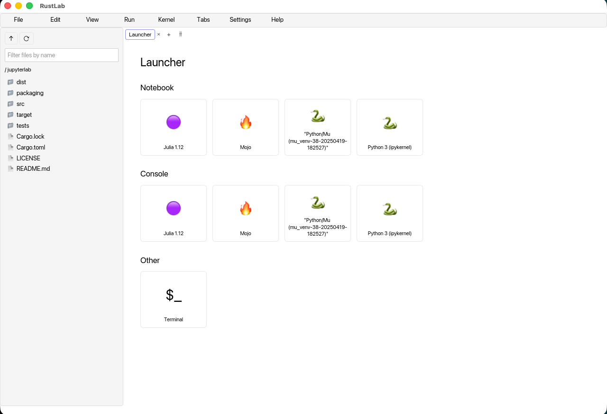
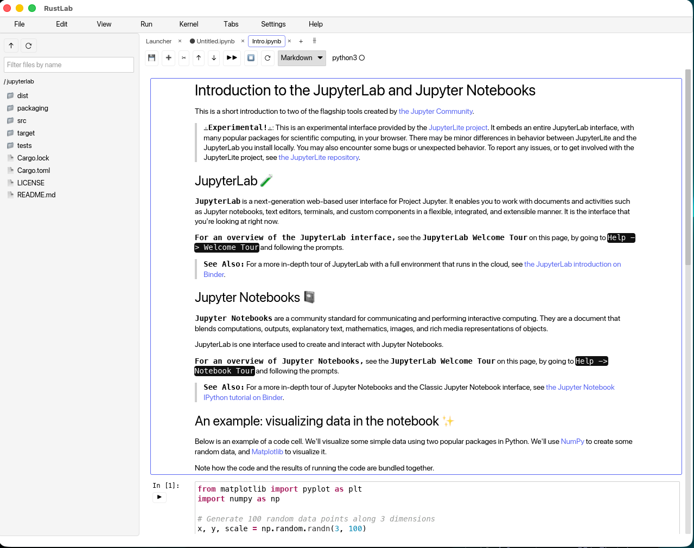

# RustLab

A native Jupyter Notebook desktop application written in Rust, using the
[iced](https://iced.rs) GUI toolkit. RustLab talks to Jupyter kernels
directly over ZeroMQ — no Python Jupyter server required. Any kernel with an
installed kernelspec works: Python (ipykernel), Julia, Mojo, R, Rust (evcxr), …

The UI follows the standard JupyterLab layout: menu bar, file-browser
sidebar, and a tabbed workspace with split panes, opening on a Launcher page
with Notebook/Console tiles per installed kernel.

## Screenshots

The Launcher — one Notebook and Console tile per discovered kernel
(Python, Julia, Mojo shown), plus terminal tabs:



A real notebook (JupyterLab's Intro.ipynb) with rendered markdown cells,
syntax-highlighted code, and live kernel execution:



## Features

- **Notebooks**: open/edit/save `.ipynb` (nbformat v4, lossless round-trip),
  syntax-highlighted code cells, Shift+Enter execution, execution queue with
  Run All, interrupt/restart kernel
- **Rich outputs**: PNG/JPEG/GIF/SVG images, markdown, ANSI-colored
  streams and tracebacks (`text/html` falls back to plain text)
- **Markdown cells**: rendered by default, double-click to edit,
  Shift+Enter to re-render
- **Cell operations**: add/delete/move/change type via toolbar, menus, or
  JupyterLab command-mode keys (`A`, `B`, `M`, `Y`, `D D`)
- **Console**: REPL tab against any kernel
- **Terminal**: real PTY terminal tabs (alacritty backend)
- **Shell**: file browser, multi-tab panes with drag/split, macOS-style
  menus with hover switching, light/dark themes

## Requirements

- **Rust** 1.88+ (edition 2024) — install via [rustup](https://rustup.rs)
- **At least one Jupyter kernel** installed. RustLab discovers kernelspecs
  from the standard Jupyter data directories and `jupyter --paths`.
  Quickest start:

  ```sh
  pip install ipykernel
  python -m ipykernel install --user
  ```

No libzmq, no Jupyter server, no Python requirement for the app itself —
the entire dependency tree is pure Rust (no C libraries), which is also why
it builds cleanly on macOS, Windows, and Linux with nothing beyond a Rust
toolchain (plus `build-essential`/MSVC Build Tools for the linker).

### Platform notes

- **macOS** 11+: signed + notarized DMG on the
  [releases page](https://github.com/skcalanderson2/rustlab/releases).
- **Windows** 10 1809+ (ConPTY needed for terminal tabs): MSI installer or
  portable zip. The installer is currently **unsigned** — SmartScreen shows
  "Windows protected your PC" on first run; click *More info → Run anyway*.
  Terminal tabs open PowerShell (`pwsh.exe` if installed, else
  `powershell.exe`).
- **Linux**: `.deb` (Ubuntu 22.04+/Debian 12+) or AppImage. File dialogs use
  the XDG desktop portal (present on all mainstream desktops). Color emoji
  in the UI need a CBDT emoji font — `fonts-noto-color-emoji` on
  Debian/Ubuntu (a Recommends of the .deb); Fedora's COLRv1-only Noto
  renders those glyphs blank (known cosmic-text limitation). AppImages need
  FUSE2 (`libfuse2t64` on Ubuntu 24.04) or run with
  `--appimage-extract-and-run`.

## Build & Run

```sh
# development (dependencies are compiled optimized; first build takes a few minutes)
cargo run

# open a notebook directly
cargo run -- path/to/notebook.ipynb

# optimized binary
cargo build --release
./target/release/rustlab

# verify kernel plumbing end-to-end without the GUI
cargo run -- --headless-test

# tests
cargo test
```

## macOS app bundle & signed installer

Prerequisites: Xcode command-line tools and a **Developer ID Application**
certificate in your keychain (for distribution outside the App Store), plus
a notarytool keychain profile for notarization:

```sh
xcrun notarytool store-credentials rustlab-notary \
  --apple-id you@example.com --team-id YOURTEAMID
```

Then:

```sh
# build RustLab.app + a signed DMG in dist/
./packaging/macos/build-installer.sh "Developer ID Application: Your Name (TEAMID)"

# notarize + staple (optional but required for Gatekeeper-clean installs)
NOTARY_PROFILE=rustlab-notary ./packaging/macos/notarize.sh
```

See [`packaging/macos/`](packaging/macos/) for the scripts, `Info.plist`,
and entitlements.

## Windows installer

On a Windows machine with Rust (MSVC) and
[WiX v3.14](https://github.com/wixtoolset/wix3/releases) installed:

```powershell
powershell -ExecutionPolicy Bypass -File packaging\windows\build-installer.ps1
```

Produces `dist\rustlab-<version>-x86_64.msi` (cargo-wix; Start Menu
shortcut, Add/Remove Programs entry) and a portable
`dist\RustLab-<version>-windows-x86_64.zip`.

## Linux packages

On a Linux machine with Rust and `build-essential` (build on the oldest
distro you want to support — the binary requires that machine's glibc or
newer):

```sh
./packaging/linux/build-packages.sh
```

Produces `dist/rustlab_<version>_amd64.deb` (cargo-deb; desktop entry +
icons included) and `dist/RustLab-<version>-x86_64.AppImage` (linuxdeploy,
downloaded automatically on first run).

## Architecture

```
src/
  app.rs               iced application: state, messages, update loop, pane/tab shell
  kernel/
    discovery.rs       kernelspec discovery (incl. `jupyter --paths`)
    worker.rs          kernel launch + per-channel ZeroMQ tasks bridged over mpsc
  notebook/model.rs    in-memory document model <-> nbformat v4 mapping
  output/
    ansi.rs            ANSI/SGR -> styled spans (parsed once at insert time)
    render.rs          mime bundle -> iced widgets (image/svg/markdown/text)
  ui/
    layout: menu.rs, sidebar.rs, launcher.rs, notebook_view.rs,
    console_view.rs, style.rs
```

Key crates: [`iced`](https://crates.io/crates/iced) 0.14,
[`jupyter-zmq-client`](https://crates.io/crates/jupyter-zmq-client) /
[`jupyter-protocol`](https://crates.io/crates/jupyter-protocol) /
[`nbformat`](https://crates.io/crates/nbformat) (the
[runtimed](https://github.com/runtimed/runtimed) family, also used by Zed's
REPL), [`iced_term`](https://crates.io/crates/iced_term) for terminals.

## License

MIT — see [LICENSE](LICENSE).
